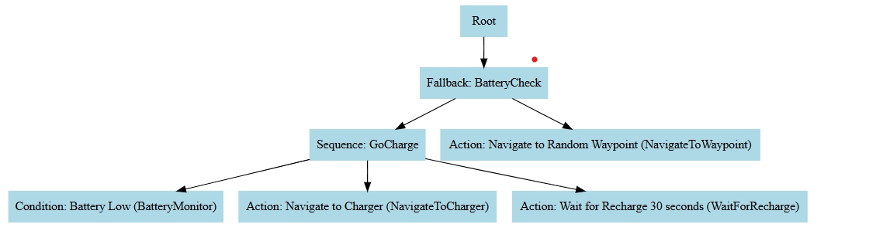
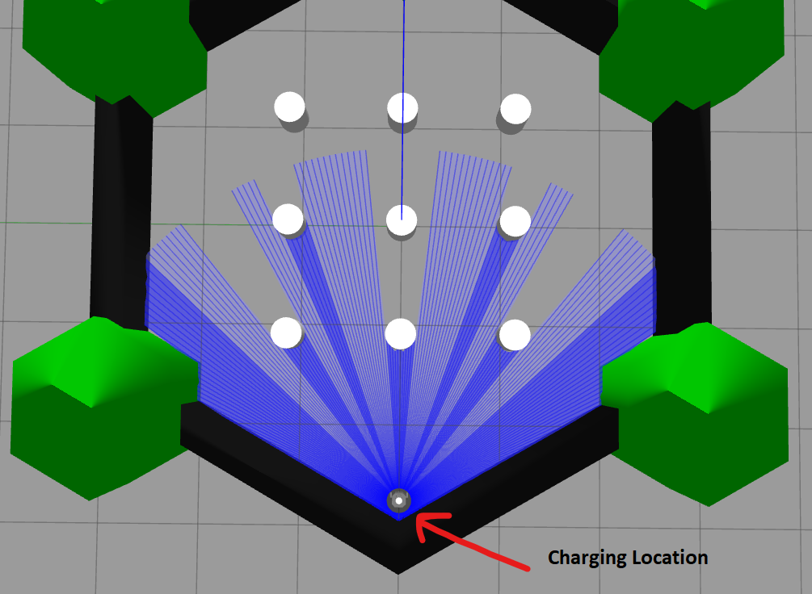

# TurtleBot3 Navigation with Behavior Trees (ROS 2 + NAV2)

This ROS 2 project uses the NAV2 stack and BehaviorTree.CPP to control a TurtleBot3 robot in simulation. The robot autonomously navigates between waypoints, monitors a simulated battery level, and goes to a charging station after 4 tasks.

---

## Features

- Fully autonomous navigation using **NAV2**
- **Behavior Trees** for decision making
- **Battery logic**: Goes to charging station after 4 tasks
- Custom behavior tree nodes:
  - `BatteryMonitor`
  - `NavigateToWaypoint`
  - `NavigateToCharger`
  - `WaitForRecharge`
- Visualized in **RViz2**
- Simulated in **Gazebo**

---

##  Project Structure

```
my_robot_nav_bt/
├── behavior_trees/        # Behavior tree XML
│   └── bt_nav.xml
├── launch/                # Launch file : Launches gazebo + rviz2 + behavior tree nodes
│   └── full_simulation.launch.py
├── maps/                  #  map of the world that was previously generated using the robot's LIDAR sensor
│   └── my_map.yaml
├── rviz/                  
│   └── my_nav_view.rviz
├── src/                   # BT nodes + main runner file
│   ├── BatteryMonitor.cpp
│   ├── NavigateToWaypoint.cpp
│   ├── NavigateToCharger.cpp
│   ├── WaitForRecharge.cpp
│   └── bt_runner.cpp
├── CMakeLists.txt
└── package.xml
```

---

## How to Launch

### 1. Build the workspace

```bash
cd ~/ros2_ws
colcon build --packages-select my_robot_nav_bt
source install/setup.bash
```

### 2. Run the simulation

```bash
ros2 launch my_robot_nav_bt full_simulation.launch.py
```

> Make sure Gazebo, NAV2, and RViz2 launch. Use RViz’s **2D Pose Estimate** tool to set the initial pose. Then the robot will choose random waypoints as the navigation goal. These locations are predefined coordinates that are safe points (clear from obstacles). After completing 4 navigation tasks the robot will go to the charging station and wait for 30 seconds (to simulate recharging)

---

## Behavior Tree Logic

```plaintext
MainTree
 └── Fallback (BatteryCheck)
     ├── Sequence (GoCharge)
     │   ├── BatteryMonitor
     │   ├── NavigateToCharger
     │   └── WaitForRecharge
     └── NavigateToWaypoint
```


- `BatteryMonitor`: checks if 4 tasks are done
- `NavigateToWaypoint`: picks a random coordinate
- `NavigateToCharger`: navigates to x:-0.31, y:2.29 (coordinates of the charging station)
- `WaitForRecharge`: waits 30 seconds

---

## Charging Station

- Location: **x = -0.31, y = 2.29**
  


---

## Testing Tips

- No manual goal setting is required
- Robot automatically selects waypoints and starts moving
- You can observe navigation behavior in RViz


To manually run just the BT engine:

```bash
ros2 run my_robot_nav_bt bt_runner
```

---

## Requirements

- ROS 2 Humble
- TurtleBot3 packages
- NAV2
- Gazebo
- BehaviorTree.CPP v3

---

## Demo Video

[]([https://www.youtube.com/watch?v=YOUR_VIDEO_ID](https://youtu.be/GCAoX1ebGJ0))

### Timeline Highlights

| Timestamp | Event                              |
|-----------|------------------------------------|
| `00:12`   | ✅ First navigation goal           |
| `00:35`   | ✅ Second navigation goal          |
| `00:58`   | ✅ Third navigation goal           |
| `01:21`   | ✅ Fourth navigation goal          |
| `01:45`   | ⚡ Robot navigates to charging dock |
| `02:15`   | 🔁 Resumes navigation after recharge |

> The robot uses Behavior Trees to autonomously alternate between navigation and recharging based on task count and battery simulation logic.

